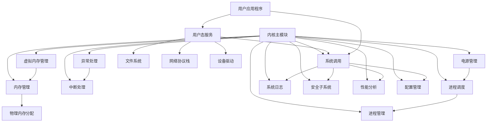

# LightweightOS 设计文档

## 概述

LightweightOS 是一个轻量级、安全且高性能的操作系统，专为现代计算需求设计。它具有微内核架构，提供强大的安全功能和卓越的性能表现。

## 系统特性

### 1. 微内核架构
- 内核只提供最基本的功能：进程调度、内存管理和进程间通信
- 所有其他服务（如文件系统、网络协议栈等）都在用户态运行
- 提高系统稳定性和安全性

### 2. 安全性
- 基于硬件的安全启动机制
- 内存保护和地址空间布局随机化 (ASLR)
- 强制访问控制和权限分离
- 加密文件系统支持
- SELinux风格的安全策略

### 3. 性能优化
- 高效的进程调度算法
- 优化的内存管理机制
- 减少不必要的系统调用开销
- 支持多核并行处理
- 虚拟内存管理支持

### 4. 轻量级设计
- 最小化系统资源占用
- 模块化设计，可根据需要加载功能模块
- 快速启动时间

## 系统架构

```
+-----------------------+
|     用户应用程序      |
|  - Shell              |
|  - 文本编辑器         |
|  - 系统监控工具       |
|  - 服务管理器         |
|  - 系统工具集         |
+-----------------------+
|     C标准库/系统库    |
+-----------------------+
|   系统服务 (用户态)   |
|  - 文件系统服务       |
|  - 网络服务           |
|  - 设备驱动服务       |
|  - 系统服务守护进程   |
+-----------------------+
|    微内核 (核心态)    |
|  - 进程调度           |
|  - 内存管理           |
|  - 虚拟内存管理       |
|  - 进程间通信         |
|  - 系统调用接口       |
|  - 安全子系统         |
|  - 性能分析模块       |
|  - 日志系统           |
|  - 配置管理           |
|  - 异常处理           |
|  - 电源管理           |
+-----------------------+
|      硬件平台         |
+-----------------------+
```

## 内核功能模块

### 进程管理
- 进程创建、销毁和调度
- 多级优先级调度算法
- 进程间通信机制 (IPC)
- 高级进程调度器支持时间片轮转和抢占式调度

### 内存管理
- 虚拟内存管理 (分页机制)
- 物理内存分配和回收
- 内存保护机制
- 页帧管理

### 中断处理
- 硬件中断处理
- 软件中断处理
- 异常处理机制
- 页错误处理

### 系统调用
- 用户态和内核态接口
- 系统服务访问接口
- 安全检查机制
- 扩展的系统调用接口 (40+ 系统调用)

### 虚拟内存管理
- 分页内存管理单元 (MMU) 支持
- 页目录和页表管理
- 页帧分配和回收
- 页错误处理

### 进程调度
- 多级优先级队列
- 时间片轮转调度
- 抢占式和非抢占式调度
- 进程睡眠和唤醒机制

### 系统日志
- 多级别日志记录 (DEBUG, INFO, WARNING, ERROR, CRITICAL)
- 环形缓冲区日志存储
- 日志统计和分析
- 日志导出功能

### 安全子系统
- 基于UID/GID的权限控制
- SELinux风格强制访问控制
- 文件和网络访问审计
- 加密功能支持 (MD5, SHA256, AES)

### 性能分析
- 系统性能统计
- 进程调度分析
- 内存使用跟踪
- 网络和磁盘I/O统计

### 配置管理
- 系统配置参数管理
- 配置文件读写支持
- 运行时配置更新
- 默认配置和用户配置分离

### 异常处理
- CPU异常处理机制
- 32种异常类型支持
- 异常统计和分析
- 默认异常处理程序

### 电源管理
- 多种电源状态支持
- ACPI电源管理
- CPU空闲处理
- 系统关机和重启

## 用户态服务

### 文件系统服务
- 支持多种文件系统格式 (FAT12/16/32)
- 日志文件系统确保数据一致性
- 加密文件系统支持
- 设备无关的文件操作接口

### 网络服务
- TCP/IP 协议栈实现
- 网络安全防护
- 支持多种网络接口
- TCP连接管理

### 设备驱动服务
- 硬件抽象层 (HAL)
- 设备驱动程序接口
- 即插即用支持
- 键盘、图形设备驱动

### 系统工具和服务
- Shell命令行界面
- 系统监控工具 (sysmon)
- 服务管理器 (svc)
- 文本编辑器
- 系统初始化程序
- 系统完整性检查工具
- 系统配置工具

## 开发计划

1. [x] 基本内核框架
2. [x] 内存管理模块
3. [x] 进程管理模块
4. [x] 中断处理系统
5. [x] 系统调用接口
6. [x] 文件系统实现
7. [x] 网络协议栈
8. [x] 设备驱动框架
9. [x] 用户空间库
10. [x] 图形用户界面
11. [x] 安全模块增强
12. [x] 性能优化调优
13. [x] 虚拟内存管理
14. [x] 高级进程调度
15. [x] 系统日志功能
16. [x] 扩展系统调用接口
17. [x] 用户空间工具和应用程序
18. [x] 系统服务管理
19. [x] 配置管理模块
20. [x] 异常处理模块
21. [x] 电源管理模块
22. [x] 系统工具集
23. [ ] 实际硬件测试
24. [ ] 更多用户应用程序
25. [ ] 图形界面应用

## 模块依赖关系



## 数据结构设计

### 进程控制块 (PCB)
- 进程ID和状态信息
- 寄存器快照
- 内存映射信息
- 调度信息

### 页表和页目录
- 页目录项结构
- 页表项结构
- 地址转换机制

### 文件系统节点
- 文件元数据
- 访问权限控制
- 文件操作接口

### 系统服务管理
- 服务状态管理
- 服务生命周期控制
- 自动启动机制

### 系统配置
- 配置参数管理
- 运行时配置更新
- 配置持久化

### 异常处理
- 异常类型定义
- 异常处理函数指针
- 异常统计信息

### 电源管理
- 电源状态管理
- 电源策略配置
- 电源事件处理

## 接口设计

### 系统调用接口
- 进程管理接口
- 内存管理接口
- 文件操作接口
- 网络操作接口
- 设备控制接口
- 系统信息接口
- 配置管理接口
- 电源管理接口

### 设备驱动接口
- 设备初始化接口
- 设备读写接口
- 设备控制接口

### 用户空间库接口
- 标准C库函数
- 系统调用封装
- 实用工具函数

### 应用程序接口
- Shell命令接口
- 系统工具接口
- 服务管理接口
- 配置管理接口

## 系统启动流程

1. BIOS/引导加载程序加载内核
2. 内核初始化硬件和基本子系统
3. 初始化虚拟内存管理
4. 初始化进程调度器
5. 启动初始化进程(init)
6. 初始化进程启动系统服务
7. 启动Shell或其他用户界面
8. 系统进入正常运行状态

## 系统管理

### 服务管理
- 系统服务的启动、停止、重启
- 服务状态监控
- 自动启动配置
- 服务依赖管理

### 系统监控
- 实时性能监控
- 资源使用统计
- 系统日志查看
- 进程状态管理

### 系统维护
- 系统更新机制
- 配置文件管理
- 备份和恢复
- 故障诊断工具
- 系统完整性检查

### 配置管理
- 系统参数配置
- 运行时配置更新
- 配置文件持久化
- 配置备份和恢复

### 电源管理
- 系统休眠和唤醒
- CPU节能模式
- 设备电源控制
- 系统关机和重启

## 安全机制

### 访问控制
- 基于用户和组的权限控制
- 文件和目录访问权限
- 网络访问控制
- 设备访问控制

### 审计和日志
- 系统活动审计
- 安全事件日志
- 访问控制日志
- 异常行为检测

### 数据保护
- 内存保护机制
- 数据加密支持
- 安全通信协议
- 敏感数据保护

## 性能优化

### 内存优化
- 高效的内存分配算法
- 内存池管理
- 缓存机制
- 内存碎片整理

### 调度优化
- 多级优先级调度
- 时间片轮转算法
- 负载均衡
- 实时任务支持

### I/O优化
- 缓冲I/O操作
- 异步I/O支持
- 设备驱动优化
- 文件系统缓存

### 网络优化
- 高效的网络协议栈
- 数据包处理优化
- 连接管理优化
- 带宽利用率优化